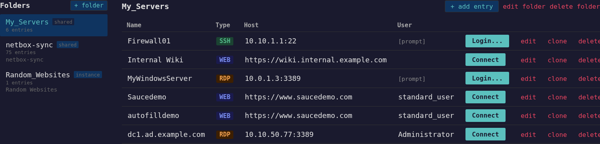
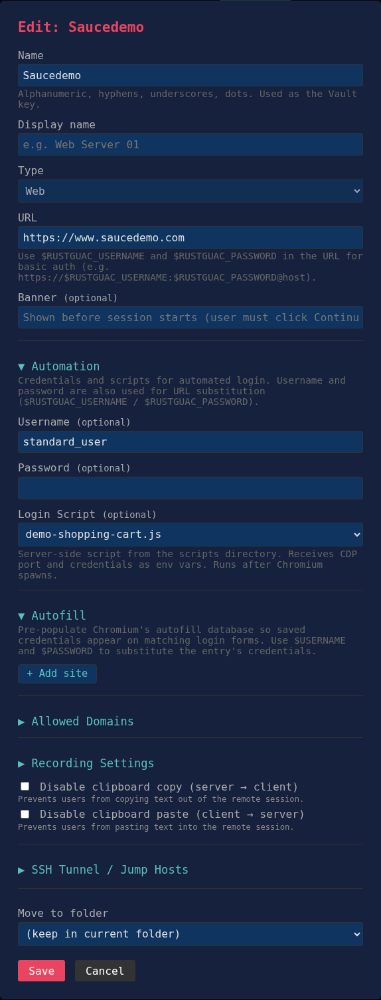

# Screenshots

Screenshots of rustguac deployed with SSO authentication (OIDC), Vault-backed address book, and session recording.

## Address Book

Vault-backed connection address book. Entries are organized into folders with group-based access control. Each entry stores connection details (type, hostname, port) in Vault — credentials never reach the browser. Entries support SSH, RDP, VNC, and web session types. The "Login..." button prompts for credentials at connect time; "Connect" launches immediately with stored credentials.

## Sessions

Ad-hoc session creation page. Powerusers can create sessions to any target by choosing a protocol (SSH, RDP, VNC, Web), entering connection details, and optionally configuring SSH tunnel jump hosts. Active sessions are listed below with real-time status.

## SSH Tunnel / Jump Hosts

Multi-hop SSH tunnel configuration with a visual flow diagram. Each hop is a collapsible card with its own hostname, port, and credentials. The flow diagram updates live to show the full route from you through the bastion hosts to the target.

## RDP Connection Editor

Address book entry editor for an RDP connection. Supports all RDP-specific fields: domain, security mode, NLA authentication package (Kerberos/NTLM), KDC Proxy URL, certificate error handling, credential prompting, and file transfer via drive redirection.

## Web Browser Session Editor

Address book entry editor for a web browser session. Spawns a headless Chromium on an Xvnc display and streams it via VNC through guacd. The URL is the only required field.

## Session Recording Playback

Session recording player with audio-style waveform histogram. Recordings are in the standard Guacamole format. The player supports play/pause, seek, and full-screen. The histogram shows activity density across the recording timeline.

## Recordings List

Recordings management page. Lists all recorded sessions with size, date, and actions (play, download, delete). Session recordings capture all screen activity for audit and compliance.

## Admin Console

Admin page with OIDC user management, group-to-role mappings, user API token management, and token audit log. Roles (admin, poweruser, operator, viewer) are mapped from OIDC group claims. Admins can disable users, force-logout sessions, and create API tokens for operators.

## API Tokens

Self-service API token management for OIDC users. Tokens authenticate via `Authorization: Bearer rgu_...` header for automation and scripting. Each token has an optional role cap and expiry date. Tokens are SHA-256 hashed at rest — the plaintext is shown once at creation.
