# Screenshots

Screenshots of rustguac v1.6.1 with the default **aurora** theme, OIDC authentication, Vault-backed Connections, and session recording. User-identifying data has been sanitised.

## Connections

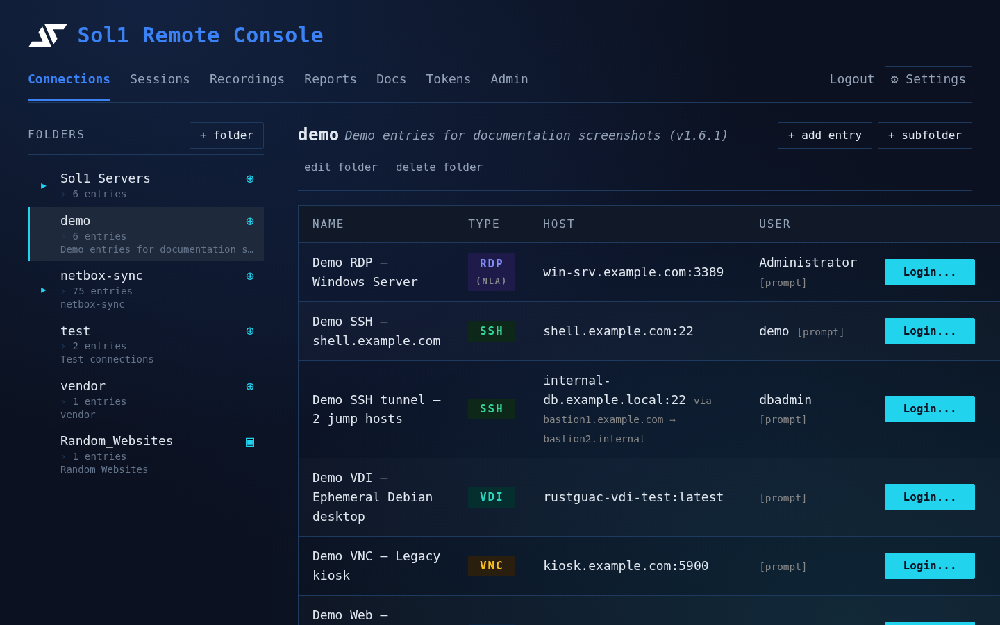

Vault-backed connection list (previously "Address Book", renamed in v1.6.0). The left sidebar shows the folder tree with lazy-loaded subfolders; scope icons indicate **⊕** shared or **▣** instance-only. Each folder has its own group access control via `allowed_groups`. Entries support SSH, RDP, VNC, Web (headless Chromium) and VDI (Docker container) session types — the type badge is colour-coded. **Login...** prompts for credentials at connect time; **Connect** launches immediately with stored credentials.

## RDP Connection Editor

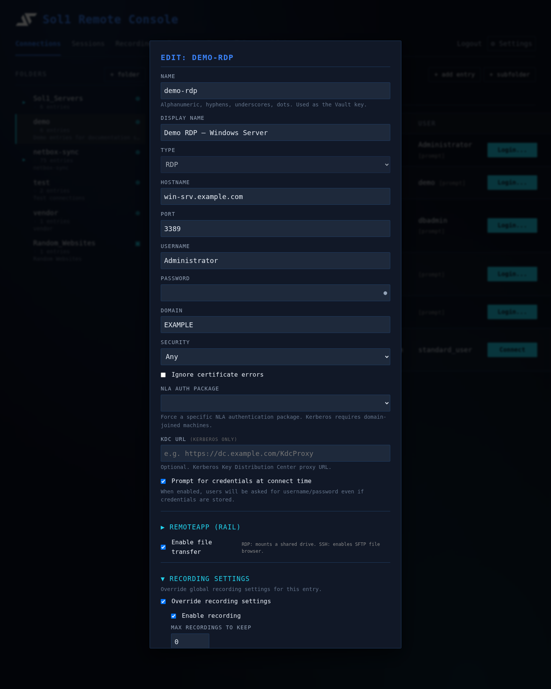

Entry editor for an RDP connection. Supports all RDP-specific fields: domain, security mode, NLA authentication package (Kerberos/NTLM), KDC Proxy URL, certificate error handling, prompt-credentials-at-connect-time, file transfer via drive redirection, RemoteApp (RAIL), and per-entry recording settings.

## Web Browser Session Editor

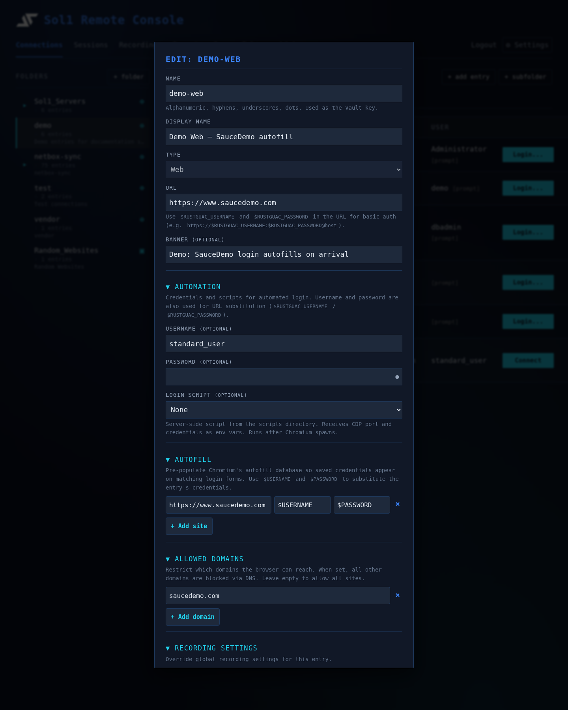

Entry editor for a web browser session. Spawns a headless Chromium on an Xvnc display and streams it via VNC through guacd. Features include an optional pre-connect banner, a collapsible **Automation** section (username/password for URL substitution, login script dropdown), an **Autofill** table (populate Chromium's saved-credentials store via `$USERNAME` / `$PASSWORD` substitution), **Allowed Domains** restriction (Chromium `--host-rules` blocks everything else), and per-entry recording settings.

## VDI Connection Editor

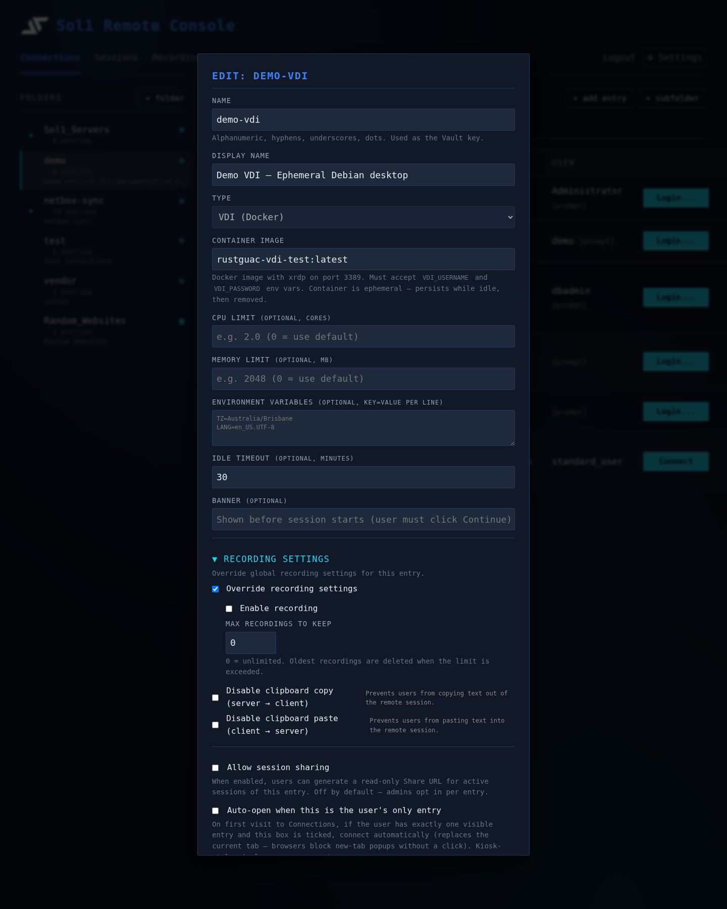

Entry editor for a VDI session (new in v1.5.0). rustguac spawns an ephemeral Docker container running xrdp and connects guacd to it via RDP. Editor fields: container image (from the admin allowlist), CPU and memory limits, extra environment variables, idle timeout, pre-connect banner, recording, clipboard copy/paste control, v1.6.0's **Allow session sharing** toggle, and v1.6.0's **Auto-open when this is the user's only entry** (kiosk mode).

## SSH Tunnel / Jump Hosts

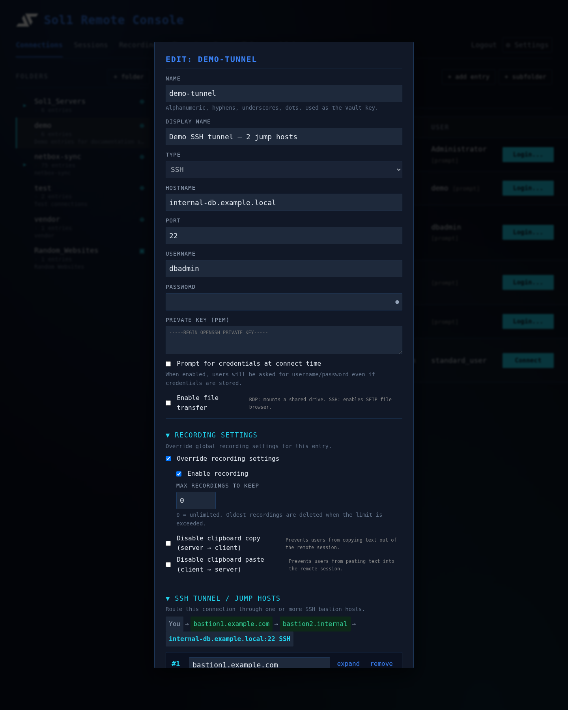

Multi-hop SSH tunnel configuration with a live flow diagram. Each hop is a collapsible card with its own hostname, port, credentials, and pinned host key. The diagram `You → bastion1 → bastion2 → internal-db` updates as you edit. Recording is captured for the final hop's session; clipboard copy/paste can be disabled per-entry.

## Sessions

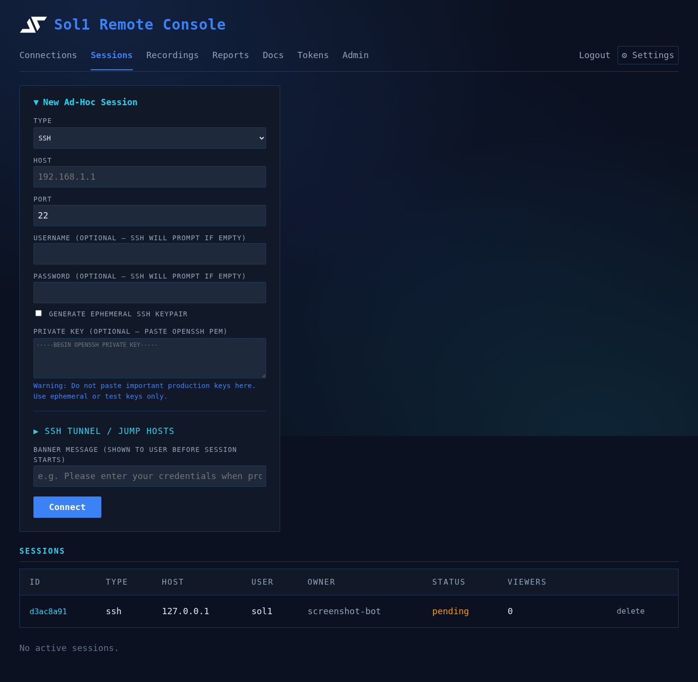

Ad-hoc session creation page. Powerusers can create sessions to any target by choosing a protocol (SSH, RDP, VNC, Web, VDI), entering connection details, and optionally configuring SSH tunnel jump hosts. The **Sessions** panel at the bottom shows active and pending sessions — in v1.6.0 this became owner-scoped by default; admins see all sessions on this page via `?all=true`.

## Session Recording Playback

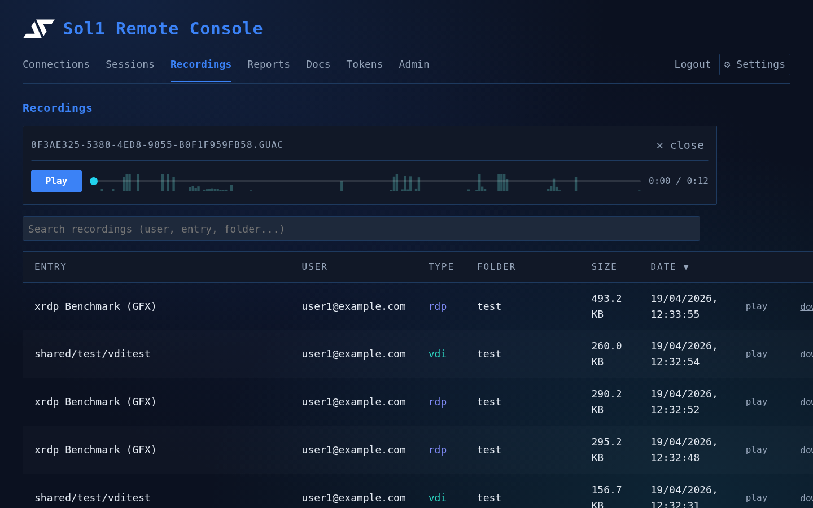

Session recording player with audio-style activity histogram. Recordings use the standard Guacamole `.guac` format. The player supports play/pause, click-to-seek, and full-screen; the histogram shows activity density across the recording timeline so reviewers can jump to the "busy" parts of a long session.

## Recordings List

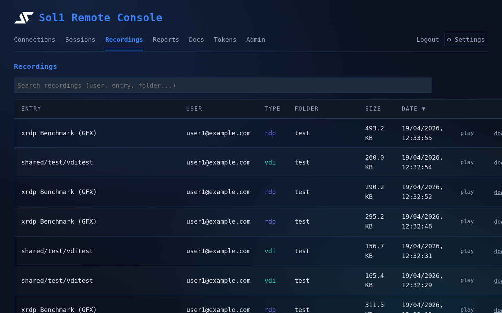

Recordings management page. Lists all recorded sessions with entry, user, protocol, folder, size, and date; the search bar filters across all fields. Recordings capture all screen activity for audit and compliance. Access is restricted to `poweruser+` from v1.5.4; deletion is admin-only.

## Reports

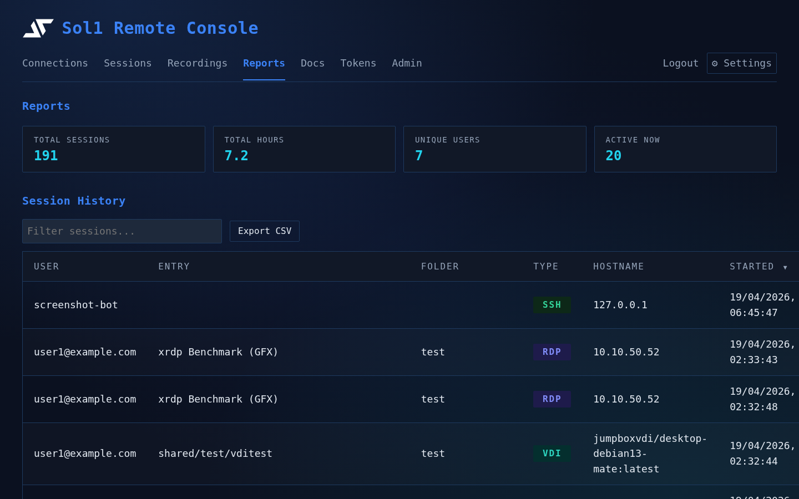

Reports dashboard — aggregate counters (total sessions, total hours, unique users, active now) plus a filterable session history table with CSV export. Each row links to the user, entry, folder, protocol, target host and start time. Useful for billing, audit, and capacity planning.

## Admin

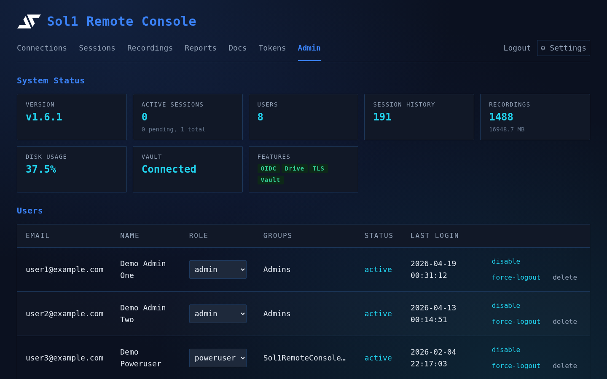

Admin page. System Status cards show rustguac version, active sessions (pending/total), user count, session-history depth, recording count and disk usage, disk pressure, Vault connection health, and enabled features (OIDC, Drive, TLS, Vault). Below is the Users table with role assignment, group membership (from OIDC claims), status and last-login, and per-user actions (disable, force-logout, delete).

## Group Mappings + User API Tokens

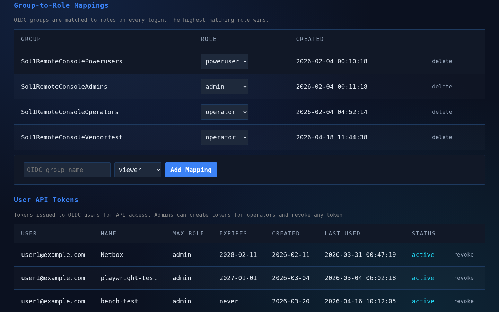

Further down the Admin page: **Group-to-Role Mappings** matches OIDC group names to rustguac roles (admin / poweruser / operator / viewer) — highest matching role wins on every login. **User API Tokens** lists OIDC-user-owned tokens issued for API access, with max-role cap, expiry, last-used timestamp, and revocation. Admins can create tokens on behalf of operators. Tokens are SHA-256 hashed at rest — the plaintext is shown once at creation and never again.
